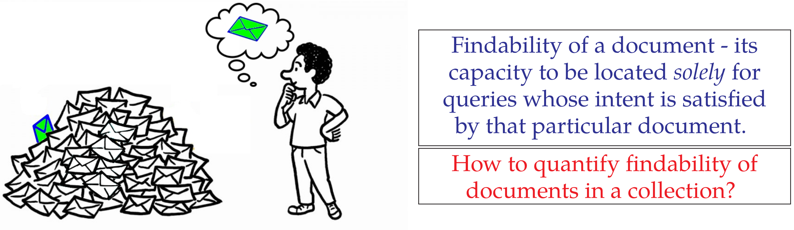

# Findability: A Novel Measure of Information Accessibility

<p>
    <a href="https://doi.org/10.1145/3583780.3615256">
        
    </a>
    &nbsp;&nbsp;&nbsp;
    <a href="https://arxiv.org/abs/2310.09508">
        
    </a>
</p>

Official implementation for our paper [Findability: A Novel Measure of Information Accessibility](https://arxiv.org/abs/2310.09508.pdf) with code, queries, plots, poster, experiment outputs. In this paper, we formalize a _findability_ measure, under the umbrella of Information Accessibility measures, and introduce an experimental methodology for measuring findability of corpus documents. From our experiments, we find huge differences in findability of documents with the same retriever.



## Is your retrieval model making your documents difficult to find?

### Paper Abstract

The overwhelming volume of data generated and indexed by search engines poses a significant challenge in retrieving documents from the index efficiently and effectively. Even with a well-crafted query, several relevant documents often get buried among a multitude of competing documents, resulting in reduced accessibility or `findability' of the desired document. Consequently, it is crucial to develop a robust methodology for assessing this dimension of Information Retrieval (IR) system performance. While previous studies have focused on measuring document accessibility disregarding user queries and document relevance, there exists no metric to quantify the findability of a document within a given IR system without resorting to manual labor. This paper aims to address this gap by defining and deriving a metric to evaluate the findability of documents as perceived by end-users. Through experiments, we demonstrate the varying impact of different retrieval models and collections on the findability of documents. Furthermore, we establish the findability measure as an independent metric distinct from retrievability, an accessibility measure introduced in prior literature.

### Findability measure

The **findability** of a document \( d \in D \) in an Information Retrieval (IR) system measures the likelihood that users can locate the document when issuing relevant queries. It is defined as the expected user convenience of finding the document across all queries \( Q_d \) for which the document is deemed relevant. The findability measure is given by the equation:

$$
f(d) = \frac{1}{|Q_d|} \sum_{q \in Q_d} \xi (p_{dq}, c)
$$

#### Notations:
- $D$: The document collection in the IR system.
- $d$: A document within the collection \( D \).
- $Q_d$: The set of all possible queries for which document \( d \) is deemed relevant (referred to as "relevant queries").
- $|Q_d|$: The size of \( Q_d \), i.e., the number of queries for which \( d \) is relevant.
- $q$: A query in \( Q_d \).
- $p_{dq}$: The rank of document \( d \) in the search results returned for query \( q \).
- $c$: The threshold rank beyond which users cease to examine the search results.
- $\xi(p_{dq}, c)$: A generalized convenience function that models the user's willingness to explore the ranked list up to rank \( p_{dq} \). It captures how "findable" the document is given its rank and the user's search behavior.

#### Inverse law of Convenience - A suitable user convenience function $\xi$

The Click-Through-Rate (CTR) of users on a search engine could be taken as a practical representation of the user effort it takes to investigate a certain rank in the results. We find inverse relation fits really well with the CTR data from Google search for top-10 ranks. So, we use this $\xi$:

$$
\xi (p_{dq}, c) =
\begin{cases}
    \frac{1}{p_{dq}} & \text{if } p_{dq} \leq c \\
    0 & \text{if } p_{dq} > c
\end{cases}
$$

### Quantifying Bias in Findability of documents across corpus

We use mean of findability $\<f\>$ and Gini coefficient (from Economics) $G$ to estimate the inequality in findability scores among the documents. For a corpus-wide improved findability of all documents, we must optimize the retriever towards higher $\<f\>$ and lower $G$.

### Comparison between Different Retrieval Models

| **Retrieval Model** &#8595 | **Corpus** &#8594 | **Robust04** | **WT10g** | **MS MARCO** |
|----------------------------|-------------------|--------------|-----------|--------------|
| **LM-Dir**                 | $G$               | 0.1587       | 0.2847    | 0.3774       |
|                            | $\<f\>$           | 0.6327       | 0.5209    | 0.5173       |
| **BM25**                   | $G$               | 0.1456       | 0.2503    | 0.3116       |
|                            | $\<f\>$           | 0.6640       | 0.5985    | 0.5895       |
| **DFR-PL2**                | $G$               | 0.1424       | 0.2497    | 0.3007       |
|                            | $\<f\>$           | 0.6672       | 0.6133    | 0.5888       |

#### Observations from the above table

- mean findability $\<f\>$ decreases and findability bias $G$ increases with **collection size**
- mean findability $\<f\>$ and findability bias $G$ seems to be inversely correlated

## Citation

Please cite the paper and star this repo if you use _findability measure_ and find it interesting/useful, thanks! Feel free to contact us at ai.amansinha@gmail.com (Aman Sinha) or mall.priyanshu07@gmail.com (Priyanshu Raj Mall), or open an issue if you have any questions.

```
@inproceedings{10.1145/3583780.3615256,
author = {Sinha, Aman and Mall, Priyanshu Raj and Roy, Dwaipayan},
title = {Findability: A Novel Measure of Information Accessibility},
year = {2023},
isbn = {9798400701245},
publisher = {Association for Computing Machinery},
address = {New York, NY, USA},
url = {https://doi.org/10.1145/3583780.3615256},
doi = {10.1145/3583780.3615256},
booktitle = {Proceedings of the 32nd ACM International Conference on Information and Knowledge Management},
pages = {4289–4293},
numpages = {5},
location = {Birmingham, United Kingdom},
series = {CIKM '23}
}
```
